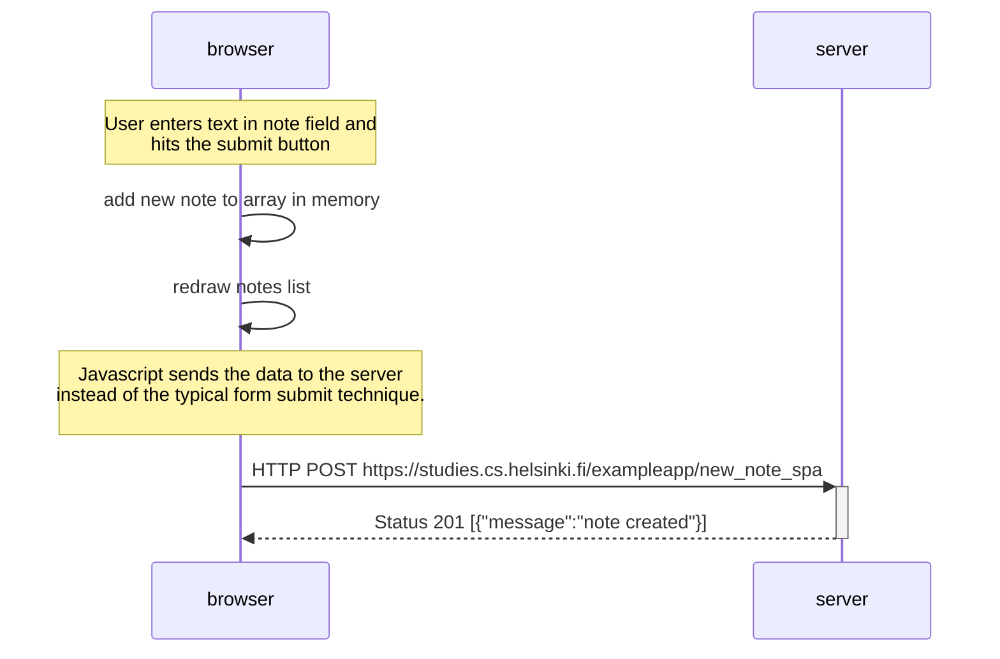

A sequence diagram of the [https://studies.cs.helsinki.fi/exampleapp/notes](https://studies.cs.helsinki.fi/exampleapp/notes)
web site.

```mermaid
sequenceDiagram
participant browser
participant server

note over browser: User enters text in note field and <br/> hits the submit button

  browser->>browser: add new note to array in memory
  browser->>browser: redraw notes list
  
note over browser: Javascript sends the data to the server <br/>instead of the typical form submit technique. <br/>

browser->>+server: HTTP POST https://studies.cs.helsinki.fi/exampleapp/new_note_spa
server-->>-browser: Status 201 [{"message":"note created"}]

```

https://mermaid.js.org/syntax/sequenceDiagram.html
